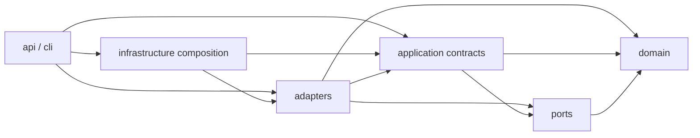

# NarrowCTI architecture overview

This is the authoritative current architecture overview for NarrowCTI Community
2.0. Versioned architecture snapshots under this directory are historical
context and do not override the current implementation or accepted ADRs.

## Direction

The dependency direction is intentionally inward:

**A → B means “A depends on B”.** Domain code is pure and inward-facing;
ports express contracts over domain behavior; application owns orchestration;
adapters implement ports and external integrations; infrastructure composes
the runtime; API and CLI entry points consume the composition.

## Current package roles

- `src/narrowcti/domain/`: pure intelligence, graph and review rules.
- `src/narrowcti/ports/`: minimal structural contracts.
- `src/narrowcti/application/`: candidate and review orchestration seams.
- `src/narrowcti/adapters/`: local persistence, OpenCTI, source and STIX
  implementations.
- `src/narrowcti/infrastructure/`: configuration and gateway composition.
- `src/narrowcti/api/` and `src/narrowcti/cli/`: delivery entry points.

The legacy roots (`core`, `connectors`, `exporters`, `gateway`) remain
compatibility surfaces while their canonical owners are migrated incrementally.

## Transitional boundary allowlist

The following imports are deliberate and temporary; they are tested as exact
source-to-target exceptions rather than broad layer permissions.

| Canonical source | Transitional import | Reason | Removal target |
| --- | --- | --- | --- |
| `src/narrowcti/application/runtime.py` | `core.decision_audit` | preserve runtime audit behavior | application/evidence wave |
| `src/narrowcti/adapters/opencti/exporter.py` | `core.graph_export_plan`, `core.opencti_graph_lookup` | preserve OpenCTI export parity | graph/export follow-up |
| `src/narrowcti/adapters/opencti/graph_lookup.py` | `core.graph_export_plan` | preserve lookup plan contract | graph/export follow-up |
| `src/narrowcti/infrastructure/config/settings.py` | `core.graph_export_plan`, `core.mitre_attack`, `core.runtime_config` | configuration compatibility | configuration/runtime follow-up |
| `src/narrowcti/infrastructure/runtime/gateway_composition.py` | `connectors.misp.*`, `connectors.otx.*`, `core.decision_audit`, `core.runtime_config` | source runtime composition | source/runtime follow-up |
| `src/narrowcti/api/review/app.py` | `core.runtime_config` | review API compatibility | API/configuration follow-up |

No wildcard or future-facing exception is implied by this table. New
cross-boundary imports require a dedicated ADR or an update to the owning
migration wave. The machine-readable source for the exact allowlist, including
owner and removal target, is
[`architecture-boundary-allowlist.json`](../development/architecture-boundary-allowlist.json).

## Deployment interoperability

NarrowCTI interoperates with OpenCTI and MISP through configured URLs, DNS and
routing, TLS, authentication/authorization, and supported APIs/protocols.
The same host, network, container platform, or orchestration stack is not
required. NarrowCTI does not require direct access to OpenCTI Elasticsearch,
RabbitMQ, Redis or PostgreSQL, nor to MISP databases or Redis.

The supported topology matrix is maintained in
[`deployment-operations.md`](../product/deployment-operations.md).

## Decision records

Migration decisions are indexed in [`adr/README.md`](adr/README.md). ADR-023
governs this documentation taxonomy and the boundary enforcement introduced by
PR-21; it does not replace the domain, application or deployment ADRs.
